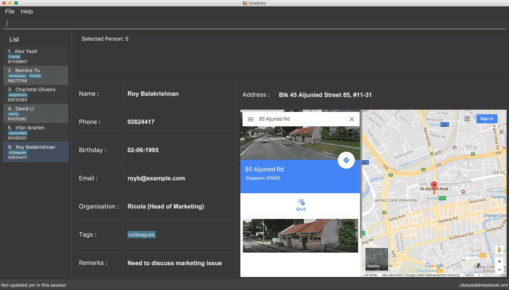

= OneBook
ifdef::env-github,env-browser[:relfileprefix: docs/]
ifdef::env-github,env-browser[:outfilesuffix: .adoc]

https://travis-ci.org/CS2103AUG2017-T17-B4/main[image:https://travis-ci.org/CS2103AUG2017-T17-B4/main.svg?branch=master[Build Status]]
https://ci.appveyor.com/project/FrozVentus/addressbook-level4-gh5we/branch/master[image:https://ci.appveyor.com/api/projects/status/wn14altnlj5mtwok/branch/master?svg=true[Build status]]
https://coveralls.io/github/CS2103AUG2017-T17-B4/main?branch=master[image:https://coveralls.io/repos/github/CS2103AUG2017-T17-B4/main/badge.svg?branch=master[Coverage Status]]

ifdef::env-github[]

endif::[]

ifndef::env-github[]
image::images/Ui.png[width="600"]
endif::[]

* This is a desktop Address Book application. It has a GUI but most of the user interactions happen using a CLI (Command Line Interface).
* This application is optimized for companies' usage. It is also suitable for general usage.
* This application allows users to easily import and export contacts, send emails conveniently and stores a database of contacts.

== Site Map

* <<UserGuide#, User Guide>>
* <<DeveloperGuide#, Developer Guide>>
* <<AboutUs#, About Us>>
* <<ContactUs#, Contact Us>>

== Acknowledgements

* Some parts of this sample application were inspired by the excellent http://code.makery.ch/library/javafx-8-tutorial/[Java FX tutorial] by
_Marco Jakob_.

* This product is adapted from https://github.com/nus-cs2103-AY1718S1/addressbook-level4[addressbook-level4] by NUS-CS2103

== Licence : link:LICENSE[MIT]
